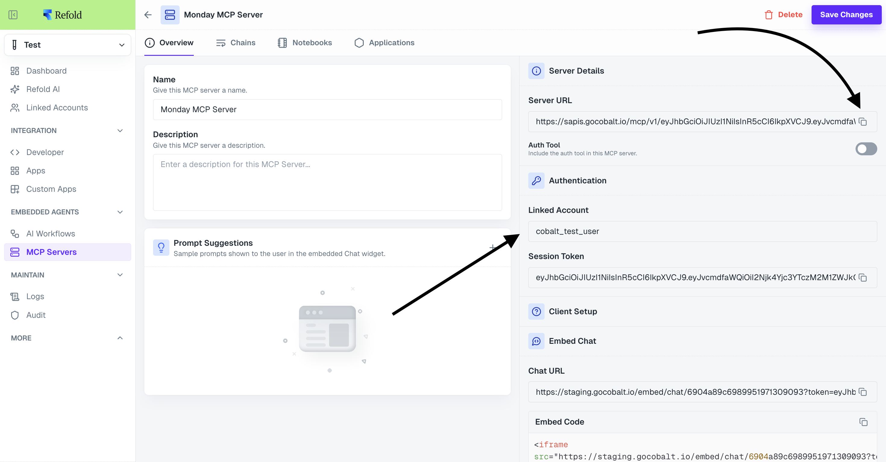
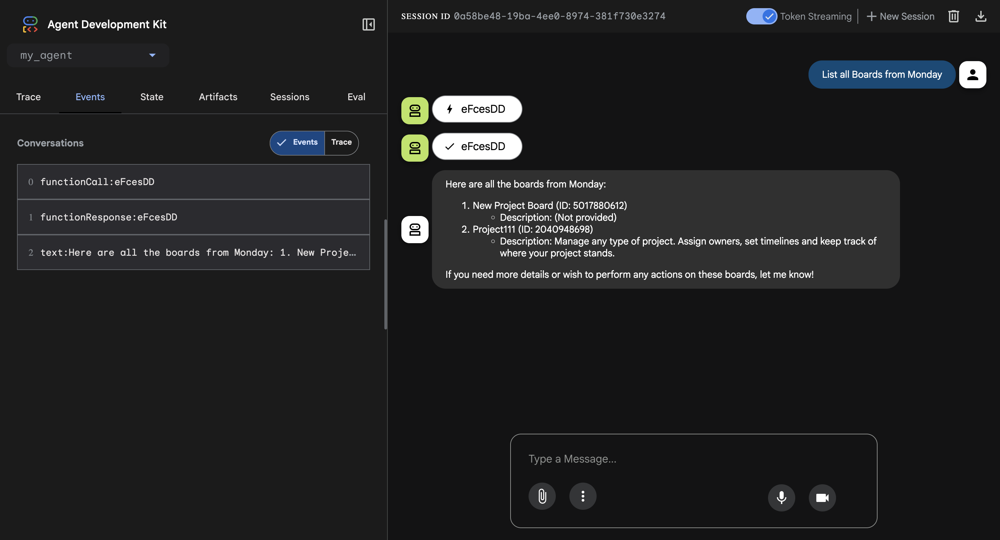

# 🤖 Refold MCP Server Integration (Bring Your Own Agent)

This repository demonstrates how to integrate **Refold’s MCP (Model Context Protocol)** Server into your existing agent infrastructure using **Google’s Agent Development Kit (ADK)**.

With this project, you can **bring your own agent (BYOA)** — built using Google ADK or any compatible framework — and extend it using Refold’s powerful MCP capabilities for enterprise-grade reasoning, orchestration, and integrations.

Learn more about [Refold.ai](https://refold.ai/) — *AI Agents Purpose-Built for Enterprise Integrations.*

---


## 🚀 Overview

This project shows how to create an agent that connects to **Refold’s MCP Server**, allowing you to leverage Refold’s tools and reasoning stack from within your own agent or application.

- Build your own ADK agent  
- Connect it to Refold’s MCP  
- Run it locally or in production with full LLM integration  

---

## 🧰 Prerequisites

- Python **3.13+**
- A **Refold account** with MCP access
- Access to your preferred **LLM API** (for the model)
- `uv` or `pip` as package manager

---

## 🔑 Getting Your MCP URL from Refold

To integrate Refold's MCP server, you need to obtain your MCP Server URL from the Refold platform:

1. **Navigate to MCP Servers**
   - Log into your Refold account
   - Go to the "MCP Servers" section in the left navigation sidebar

2. **Access Your MCP Server Configuration**
   - Select or create your MCP server (e.g., "Monday MCP Server")
   - Click on the "Overview" tab

3. **Copy Your Server URL**
   - In the **Server Details** section, you'll find the **Server URL** field
   - Click the copy icon next to the URL to copy it
   - The URL format looks like: `https://api.gocobalt.io/mcp/v1/eyJhbGciOiJIUzI1NilsInR5cCl6lkpXVCJ9...`

📸 *Visual guide:* 



The image shows the **Server URL** field in the **Server Details** section after selecting **Linked Account**, highlighted by the arrow pointing to it. This is the URL you need to copy and use as your `MCP_URL` environment variable.

## ⚙️ Installation

### Using uv (Recommended)

```bash
# Install dependencies
uv sync

# Activate the virtual environment
source .venv/bin/activate  # On macOS/Linux
# or
.venv\Scripts\activate  # On Windows
```

### Using pip

```bash
# Create a virtual environment
python -m venv .venv

# Activate the virtual environment
source .venv/bin/activate  # On macOS/Linux
# or
.venv\Scripts\activate  # On Windows

# Install dependencies
pip install -e .
```

## Configuration

A `.env.example` file is provided in the `my_agent/` folder as a template. Copy it to create your `.env` file:

```bash
cp my_agent/.env.example .env
```

Then edit the `.env` file in the project root directory and fill in your actual values:

```env
MODEL_NAME="MODEL_NAME"
MODEL_URL="MODEL_URL"
MODEL_API_KEY="MODEL_API_KEY"
MCP_URL="REFOLD_MCP_URL"
```

**Note:** Replace the placeholder values with your actual:
- **MCP_URL**: The Server URL copied from your Refold MCP Server Overview page (format: `https://api.gocobalt.io/mcp/v1/your-token-here`)
- **MODEL_NAME**: The name of the LLM model you want to use (e.g., "gpt-4", "claude-3-opus")
- **MODEL_URL**: The base URL for your LLM API provider (e.g., `https://api.openai.com/v1`)
- **MODEL_API_KEY**: Your API key for authenticating with the LLM service


## Project Structure

```
BYOA-MCP/
├── my_agent/
│   ├── __init__.py
│   ├── agent.py          # Main agent implementation
│   └── .env.example      # Environment variables template
├── img/
│   ├── refold_mcp_server.png  # Visual guide for finding MCP URL
│   └── showcase.png          # ADK Web interface screenshot
├── pyproject.toml        # Project dependencies
├── uv.lock              # Dependency lock file
├── .env                 # Environment variables (create from .env.example)
└── README.md           # This file
```

## How It Works

The agent (`my_agent/agent.py`) creates an agent instance that:

1. **Initializes the Model**: Uses LiteLLM to connect to your specified LLM provider
2. **Connects to Refold MCP**: Uses `MCPToolset` with `StreamableHTTPConnectionParams` to connect to Refold's MCP server
3. **Provides Tools**: The agent has access to all tools provided by Refold's MCP server
4. **Executes Tasks**: Can interact with Refold's capabilities through the MCP protocol

## Usage

### Running with ADK Web

The easiest way to run and interact with your agent is using ADK's web interface:

```bash
adk web
```

This will start a web server and open your browser to an interactive interface where you can:
- Chat with your agent
- See the agent's responses in real-time
- Test the Refold MCP integration
- Monitor agent interactions and tool usage



*The ADK Web Interface showing a conversation with the agent, function calls, and responses. You can see the agent successfully retrieving data from Monday.com boards through Refold's MCP integration.*

The web interface will automatically discover and load your agent from `my_agent.agent.root_agent`.

## Dependencies

- **google-adk** (>=1.17.0): Google's Agent Development Kit for building agents
- **litellm** (>=1.79.0): Unified interface for multiple LLM providers

## Support

For issues related to:
- **Refold MCP Server**: Contact Refold support, refer to Refold documentation, or visit [Refold.ai](https://refold.ai/)
- **Google ADK**: Check [Google ADK documentation](https://github.com/google/adk)
- **LiteLLM**: Visit [LiteLLM documentation](https://docs.litellm.ai/)

---

**Refold.ai © 2025** - [https://refold.ai/](https://refold.ai/)


